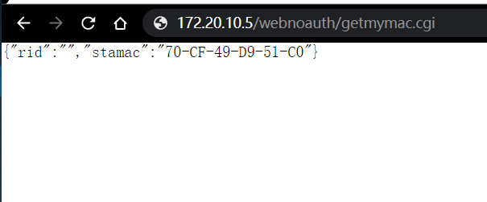

# PoC

<<<<<<< HEAD
Netcore G1 and N3 devices have unauthorized access vulnerabilities. The attacker can access http://ip/webnoauth/getmymac.cgi without authorization, leaking the mac address of the router
=======
Netcore G1 and N3 devices have unauthorized access vulnerabilities before v3.0.4. The attacker can access http://ip/webnoauth/router_model.cgi without authorization, leaking the mac address and firmware version of the router
>>>>>>> f418f7223c7f1d1c147dae05e81c7b8471884c04

#### http://ip/webnoauth/getmymac.cgi

<<<<<<< HEAD

=======

>>>>>>> f418f7223c7f1d1c147dae05e81c7b8471884c04

#### Acknowledgement

Thanks to the partners who discovered the vulnerability together：

Yi-fei Gao

Zhen-hua Wang

En-Ze Wang

Wei Xie
