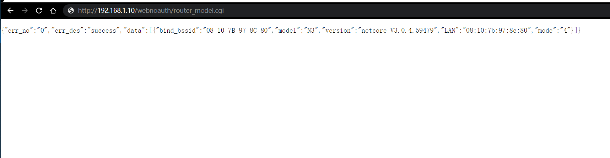

# PoC

Netcore G1 and N3 devices have unauthorized access vulnerabilities. The attacker can access http://ip/webnoauth/router_model.cgi without authorization, leaking the mac address of the router

#### http://ip/webnoauth/router_model.cgi

#### Acknowledgement

Thanks to the partners who discovered the vulnerability together：

Yi-fei Gao

Zhen-hua Wang

En-Ze Wang

Wei Xie