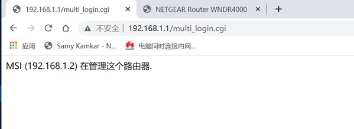

# PoC

The Netgear-WNDR4000 router has an unauthorized access vulnerability. The attacker can access http://ip/multi_login.cgi without authorization. Leaked the ip and username of the administrator

#### http://ip/multi_login.cgi

#### Acknowledgement

Thanks to the partners who discovered the vulnerability together：

Yi-fei Gao

Zhen-hua Wang

En-Ze Wang

Wei Xie