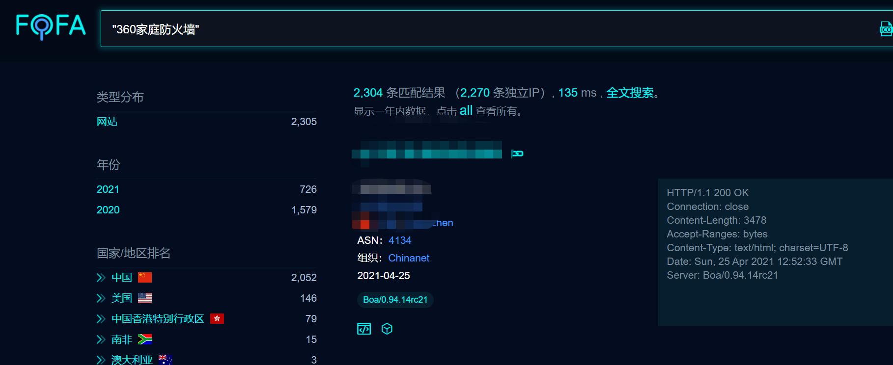
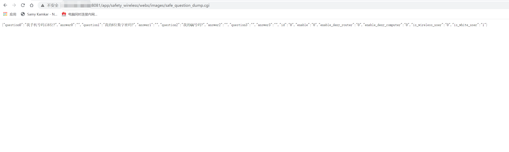
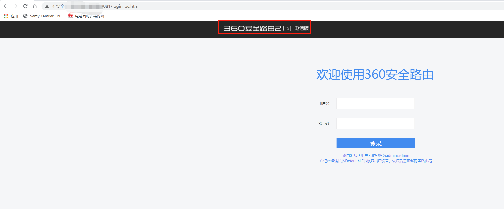

## 0x00 Summary

In the 360 ​​home firewall and router, there is an unauthorized access in safe_question_dump.cgi, which leads to the leakage of the password question and answer of the anti-rub network firewall 


## 0x01 Tested Versions

360 Security Router-Telecom Version T3, 360 Home Firewall-Router 5C


## 0x02 PoC

Only need to visit `http://www.test.com/app/safety_wireless/webs/images/safe_question_dump.cgi`   to disclose sensitive information


## 0x03 Vulnerability test example

Use the fofa search engine to retrieve the target, such as using the following dork syntax to get the target of the specified version.
```
dork: "360家庭防火墙"
```



Next, select the T3 version or the C5 version from the results to test the poc






## 0x04 Acknowledgement

Thanks to the partners who discovered the vulnerability together：

Fei-yi Gao

En-Ze Wang

Zhen-hua Wang 

